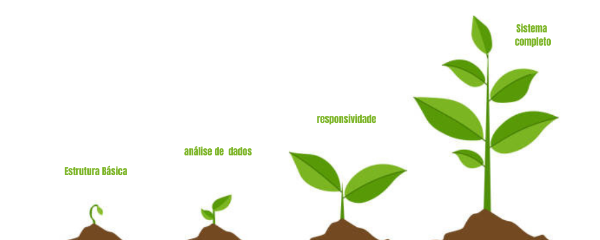

 

<a href="#objetivo">Objetivo</a> | <a href="#visao">Visão</a> | <a href="#metodologia">Metodologia</a> | <a href="#tecnologias">Tecnologias</a> | <a href="#mvp">MVP</a> | <a href="#como_utilizar">Como utilizar</a> | <a href="#cronograma">Cronograma</a> | <a href="#equipe">Equipe</a>  | <a href="#backlog">Backlog</a>

<h2 align=center id="objetivo">🎯Objetivo do Projeto</h2>

Implementar um sistema para a inserção de dados, bem como o desenvolvimento de uma solução para a visualização personalizada desses dados, visando aprimorar a eficiência da agricultura indoor.

<h2 align=center id="visao">👨‍🎨
 Visão do Produto</h2>
 

 

O produto visa criar uma plataforma online que funcione como um centro de dados para a agricultura indoor. Esta plataforma receberá dados de diferentes sensores e dispositivos utilizados no cultivo indoor, analisará esses dados de forma inteligente e os apresentará aos usuários por meio de gráficos e visualizações intuitivas. Nosso objetivo é capacitar os agricultores indoor a tomar decisões mais informadas e eficazes, permitindo-lhes monitorar o ambiente de cultivo, detectar tendências e anomalias, e otimizar os recursos para maximizar a produtividade e a qualidade dos cultivos.

<h2 align=center id="metodologia">👩‍🏫Metodologia</h2>

No desenvolvimento do produto, seguimos a abordagem ágil do Scrum, um método conhecido por sua flexibilidade e eficácia. Utilizando essa metodologia, dividimos o trabalho em ciclos chamados Sprints, nos quais entregamos incrementos do produto. Antes de cada Sprint, priorizamos as tarefas com base no valor que agregariam ao cliente, definindo assim nosso Produto Mínimo Viável (MVP). Com o MVP estabelecido, construímos o backlog do projeto, detalhando as tarefas necessárias para alcançar nossos objetivos.

<h2 align=center id="tecnologias">⌨️Tecnologias</h2>
<ul>
<li>Figma: Prototipagem</li>
<li>Html: Estruturação de páginas web</li>
<li>Css: Estilização</li>
<li>Bootstrap: Estilização</li>
<li>JavaScript: Funcionalidades</li>
<li>Python: Backend</li>
<li>Flask: Servidor local</li>

</ul>

<h2 align=center>  </h2>
    

      

<!-- video sprint 1 -->
https://github.com/FabioHiros/API-GreenTECH/assets/144804717/87000834-bb4b-43c3-adba-09a89bdb7615

<h2 align=center id="como_utilizar">💻Como utilizar o projeto:</h2>
<ol>
<li>Instale o <a href="https://www.python.org/">Python</a> mais atualizado </li>
<li>Baixe os arquivos do projeto</li>
<li>Abra o cmd e entre na pasta do projeto 
<code>cd caminho_para_sua_pasta/src</code></li>
<li>Crie o ambiente virtual : Utilize os comandos abaixo no cmd que você utilizou no passo anterior 
<code>python -m venv venv </code> 
<code>.\venv\Scripts\activate </code> 
<code>pip install -r requirements.txt</code></li>
<li>Rodando o programa:

<code>flask run</code></li>
    copie o ip que aparece para o navegador

</ol>

  

<h2 id='cronograma'>Cronograma de entregas<h2>

| Item                                                     | Data de Entrega | Grau de Prioridade  | ID |
|----------------------------------------------------------|-----------------|---------------------|----|
| Backlog                                                  | 29/03           | 100               | 01 |
| Wireframe                                                | 01/04           | 95                | 02 |
| Menu Base                                        | 04/04           | 85               | 03 |
| Landing Page                                     | 13/04           | 80               | 04 |
| Página dos Gráficos                                        | 12/04           | 75                | 05 |
| Página de Upload                                   | 14/04           | 70               | 06 |
| Implementação do flask                                 | 09/04           | 65                | 07 |
| Readme                                   | 14/04           | 60               | 08 |
| Obtenção dos dados                                 | 28/03           | 20                | 09 |

 
 

<h2 align=center id="backlog">🗄 Backlog</h2>

| Item | Prioridade | ID | Descrição | Sprint|
| ---- | ---------- | -- | --------- | ----- |
| Criação da Estrutura do Software | 100 |#1| "Como Cliente quero ter maior visualização da Estrutura do software" | **1** |
| Desenvolvimento da Pagina de Layout | 95 |#2| "Como cliente quero ter visualização de três cards de direcionamento intuitivos " | **1** |
|Desenvolvimento da Interface Intuitiva  | 85 |#3| "Enquanto cliente quero uma interface pratica e de facil uso" | **1**|
| Flask | 75 |#4| ""Criação do backend da pagina""| **1** |
| Tabela  de Variaveis | 70 |#5| "Enquanto cliente quero uma tabela de acordo com resultado dos dados"| **1** |
| Graficos Ilustrativos | 65 |#6| "Eu como cliente quero, encontrar no site, exemplos práticos para que o método seja aplicado para meus funcionários de forma padronizada". | **1** |
| Implementação para Upload | 60 |#7| "Enquanto cliente quero uma solução para realizar upload de dados" | **2** |
| Implementação de Dados  | 55 |#8| "Enquanto Cliente quero que os dados sejam implementados em tempo real" | **2**|
| Implementação de suporte  | 50 |#9| "Enquanto cliente quero um suporte para os dados"| **3** |
| Melhorias de Desempenho Funcional | 45 |#10| "Enquanto cliente quero melhor desempenho funcional". | **3** |
| Leitura temporal de dados  | 40 |#11| "Enquanto cliente quero leitura por hora dos dados". | **3** |
| Responsividade  | 35 |#12| "Enquanto cliente quero que a pagina suporte, website e mobile" | **3** |
| README | 30 |#13| Documentação do projeto. | **4** |

<!--  -->

  

<h2 id="equipe"> Equipe: </h2>
<table>
    <tr>
        <th> Foto </th>
        <th> Função </th>
        <th> Nome </th>
        <th> Linkedin </th>
        <th> Git Hub </th>
    </tr>
    <tr>
        <td> </td>
        <td> Scrum Master </td>
        <td> Fábio Hiroshi </td>
        <td>  </td>
        <td>  </td>
    </tr>
    <tr>
        <td>  </td>
        <td> Product Owner </td>
        <td> Alexandre Ribeiro </td>
        <td>  </td>
        <td>  </td>
    </tr>
    <tr>
        <td>  </td>
        <td> Scrum Team </td>
        <td> kathellyn Santos </td>
        <td>  </td>
        <td>  </td>
    </tr>
    <tr>
            <td>  </td>
        <td> Scrum Team </td>
        <td> Eric Kawata </td>
        <td>  </td>
        <td>  </td>
    </tr>
    <tr>
        <td>  </td>
        <td> Scrum Team </td>
        <td> Bianca Isabela </td>
        <td>  </td>
        <td>  </td>
    </tr>
    <tr>
        <td>  </td>
        <td> Scrum Team </td>
        <td> Gabriel Lourenço </td>
        <td>  </td>
        <td>  </td>
    </tr>
    <tr>
        <td>  </td>
        <td> Scrum Team </td>
        <td> Thiago Silva </td>
        <td>  </td>
        <td>  </td>
    </tr>
</table>

